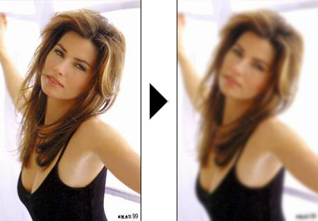



## Abhishek's Image Processing \- Bluring A Image

### Description

A Simple Algorithm For Blurring Images.Note: The Depth Of The Blur Is In Amount Of Times The Algorithm Is Applied
 
### More Info
 

             |
---                |---
**Submitted On**   |2005-04-18 01:54:16
**By**             |[Abhishek Kalsekar](https://github.com/Planet-Source-Code/PSCIndex/blob/master/ByAuthor/abhishek-kalsekar.md)
**Level**          |Intermediate
**User Rating**    |4.0 (8 globes from 2 users)
**Compatibility**  |VB 4\.0 \(32\-bit\), VB 5\.0, VB 6\.0
**Category**       |[Graphics](https://github.com/Planet-Source-Code/PSCIndex/blob/master/ByCategory/graphics__1-46.md)
**World**          |[Visual Basic](https://github.com/Planet-Source-Code/PSCIndex/blob/master/ByWorld/visual-basic.md)
**Archive File**   |[Abhishek's1877854172005\.zip](https://github.com/Planet-Source-Code/abhishek-kalsekar-abhishek-s-image-processing-bluring-a-image__1-60064/archive/master.zip)

